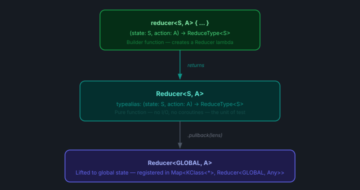

# Komposed

> Unidirectional state management for Android, built in Kotlin

[](https://central.sonatype.com/artifact/io.github.atwa/komposed)
[](https://github.com/atwa/komposed/actions/workflows/publish.yml)
[](https://opensource.org/licenses/MIT)
[](https://developer.android.com/studio/releases/platforms)
[](https://kotlinlang.org)

Komposed is a lightweight Kotlin library for predictable, testable state management on Android. State transitions are pure functions. Side effects are typed values. Everything composes — features, reducers, and tests alike.

Inspired by the core ideas of [The Composable Architecture (TCA)](https://github.com/pointfreeco/swift-composable-architecture) by Point-Free, Komposed adapts its fundamental building blocks — reducers, effects, lenses, and middleware — to idiomatic Kotlin and Jetpack Compose, without requiring any prior TCA knowledge.

---

## Architecture Diagrams

### 1 — Unidirectional Data Flow
Every state change follows a single predictable path. Actions flow down through middleware into reducers; new state and effects flow back up to the UI.


### 2 — Reducer Type Hierarchy
How a `reducer<S,A,H>{}` with dependencies becomes a registered `PureReducer` in the store's action map.



### 3 — State Composition via Lenses
A single global state is sliced into feature sub-states using `Lens<GLOBAL, LOCAL>`. Each reducer operates only on its own slice — completely unaware of siblings.


### 4 — Effect Types & Lifecycle
Effects are the controlled escape hatch for async work. The store launches them in the background and re-dispatches any produced action back through the full middleware chain.


### 5 — Module Structure
Core library modules have zero Android feature dependencies; each sample feature is its own Gradle module following the same internal layering.


### 6 — Testing Architecture
Each layer of the architecture has a dedicated testing tool. Pure reducers need no coroutines; integration tests use `TestScope` for deterministic async.


---

## Why Komposed?

| What you get | Why it matters |
|---|---|
| Pure reducers | No I/O, no coroutines inside — trivially unit-testable with plain `assertEquals` |
| Sealed action types | Exhaustive `when` branches enforced at compile time |
| Lens-based composition | Multiple feature reducers share one global store with zero boilerplate |
| First-class Effects | `ActionableEffect`, `FlowEffect`, `SuspendEffect` — async work as values |
| Extensible Middleware | Logging, analytics, A/B flags — none of it touches a reducer |
| Navigation as an Effect | `NavController` never leaks into a ViewModel or reducer |
| Fluent test DSL | `reducer.provide(fakeHandler).given(state, action).assertState(…).assertEffect<T>()` |

---

## Installation

Add the dependencies to your module's `build.gradle.kts`:

```kotlin
implementation("io.github.atwa:komposed:1.0.0")

// Testing utilities — add to the test source set only
testImplementation("io.github.atwa:komposed-testing:1.0.0")
```

Or with a version catalog (`gradle/libs.versions.toml`):

```toml
[versions]
komposed = "1.0.0"

[libraries]
komposed       = { group = "io.github.atwa", name = "komposed",         version.ref = "komposed" }
komposed-testing = { group = "io.github.atwa", name = "komposed-testing", version.ref = "komposed" }
```

```kotlin
implementation(libs.komposed)
testImplementation(libs.komposed.testing)
```

**Requirements:** minSdk 24 · Kotlin 2.0 · Java 11 · `kotlinx-coroutines-core` (transitive)

---

## Quick Start

The five-minute path from zero to a working store:

```kotlin
// 1. State
data class CounterState(val count: Int = 0)

// 2. Actions
sealed interface CounterAction {
    data object Increment : CounterAction
    data object Decrement : CounterAction
}

// 3. Reducer (pure — no I/O)
import io.github.atwa.komposed.ReduceType.Companion.reduce

val counterReducer = pureReducer<CounterState, CounterAction> { state, action ->
    when (action) {
        CounterAction.Increment -> state.copy(count = state.count + 1).reduce()
        CounterAction.Decrement -> state.copy(count = state.count - 1).reduce()
    }
}

// 4. Store (inside ViewModel)
val store = createStore(
    initialValue = CounterState(),
    scope        = viewModelScope,
    reducers     = reducers { counterReducer.register() },
)

// 5. UI
val state by store.state.collectAsStateWithLifecycle()
Text("Count: ${state.count}")
Button(onClick = { store.dispatch(CounterAction.Increment) }) { Text("+") }
```

---

## Core Concepts

### State

State is an **immutable `data class`**. Every change produces a new instance via `copy()`. The store exposes it as `StateFlow<S>`, so Compose collects it automatically.

```kotlin
data class CartState(
    val items: List<CartItem> = emptyList(),
    val isLoading: Boolean    = false,
    val error: String?        = null,
)
```

For multi-feature screens, compose sub-states and declare **Lenses** as companions:

```kotlin
data class CheckoutState(
    val cart:       CartState       = CartState(),
    val delivery:   DeliveryState   = DeliveryState(),
    val placeOrder: PlaceOrderState = PlaceOrderState(),
) {
    companion object {
        val cartLens       = lens(CheckoutState::cart)       { copy(cart = it) }
        val deliveryLens   = lens(CheckoutState::delivery)   { copy(delivery = it) }
        val placeOrderLens = lens(CheckoutState::placeOrder) { copy(placeOrder = it) }
    }
}
```

> See **Diagram 3** in [`docs/architecture.html`](docs/architecture.html) for a visual of how lenses slice global state.

---

### Actions

Actions are **`sealed interface`** hierarchies. They carry all data a reducer needs to compute the next state and are the _only_ way to trigger a change.

```kotlin
sealed interface CartAction {
    data object LoadCart : CartAction
    data class  CartLoaded(val items: List<CartItem>) : CartAction
    data class  CartFailed(val message: String)       : CartAction
    data class  RemoveItem(val itemId: String)        : CartAction
}
```

---

### ReduceType

Every reducer returns a `ReduceType<STATE, ACTION>` — a sealed type with three variants, each constructed via a companion DSL:

```kotlin
import io.github.atwa.komposed.ReduceType.Companion.reduce
import io.github.atwa.komposed.ReduceType.Companion.withEffect
import io.github.atwa.komposed.ReduceType.Companion.effect
```

| Variant | DSL | When to use |
|---|---|---|
| `Reduce` | `state.reduce()` | Pure state transition, no side effects |
| `ReduceWithEffect` | `state.withEffect { MyEffect(…) }` | State change + async work |
| `SideEffect` | `effect { MyEffect(…) }` | Async work with no state change |

---

### Reducers

#### Pure Reducer — no dependencies

Use `pureReducer` when all state transitions are pure and require no external services. Every `when` branch returns a `ReduceType` built from the new state — no I/O, no coroutines:

```kotlin
val cartReducer = pureReducer<CartState, CartAction> { state, action ->
    when (action) {
        CartAction.LoadCart ->
            state.copy(isLoading = true, error = null).reduce()
        is CartAction.CartLoaded ->
            state.copy(items = action.items, isLoading = false).reduce()
        is CartAction.CartFailed ->
            state.copy(isLoading = false, error = action.message).reduce()
        is CartAction.RemoveItem ->
            state.copy(items = state.items.filterNot { it.id == action.itemId }).reduce()
    }
}
```

When `LoadCart` also needs to trigger a network fetch, use `reducer { }` with an injected handler instead — shown in the next section.

#### Reducer with injected Handler — has dependencies

When the reducer needs I/O (network, database), declare a **handler interface** and pass it as a type parameter. The reducer stays pure — it only calls the interface, never the implementation.

```kotlin
// Handler interface lives in presentation/
interface CartEffectHandler {
    suspend fun loadCart(): CartAction
}

// Reducer references the interface only
val cartReducer = reducer<CartState, CartAction, CartEffectHandler> { state, action, handler ->
    when (action) {
        CartAction.LoadCart ->
            state.copy(isLoading = true).withEffect {
                ActionableEffect { handler.loadCart() }
            }
        is CartAction.CartLoaded ->
            state.copy(items = action.items, isLoading = false).reduce()
        is CartAction.CartFailed ->
            state.copy(isLoading = false, error = action.message).reduce()
        is CartAction.RemoveItem ->
            state.copy(items = state.items.filterNot { it.id == action.itemId }).reduce()
    }
}

// Real implementation lives in data/ and is injected by Hilt
class CartEffectHandlerImpl @Inject constructor(
    private val repository: CartRepository,
) : CartEffectHandler {
    override suspend fun loadCart(): CartAction =
        repository.getItems().fold(
            onSuccess = { CartAction.CartLoaded(it) },
            onFailure = { CartAction.CartFailed(it.message ?: "Unknown error") },
        )
}
```

`reducer { ... }` returns a `ReducerFactory`. Call `.provide(handler)` to get a plain `PureReducer` (or let the `reducers { }` DSL do it automatically via `.scoped(handler, lens)`).

> See **Diagram 2** in [`docs/architecture.html`](docs/architecture.html) for the full type transformation chain.

---

### Effects

Effects are the controlled escape hatch for async work. The store launches them in a coroutine scope and re-dispatches any produced action through the full middleware chain.

| Type | Constructor | Behaviour |
|---|---|---|
| `ActionableEffect` | `ActionableEffect { suspend → ACTION }` | Awaits the suspend block; dispatches the returned action |
| `FlowEffect` | `FlowEffect { flowOf(…) }` | Collects the `Flow`; dispatches each emission |
| `SuspendEffect` | `SuspendEffect { /* Unit */ }` | Runs to completion; dispatches nothing |
| `NavigationEffect` | `NavigationEffect { navigate(…) }` | Intercepted by `navigationMiddleware`; calls the `Navigator` lambda |

```kotlin
// ActionableEffect — single async result
is CartAction.LoadCart ->
    state.copy(isLoading = true).withEffect {
        ActionableEffect { handler.loadCart() }
    }

// FlowEffect — continuous stream
is CartAction.ObserveCart ->
    effect { FlowEffect { repository.observeItems() } }

// SuspendEffect — fire-and-forget
is CartAction.TrackView ->
    effect { SuspendEffect { analytics.track("cart_viewed") } }

// NavigationEffect — type-safe routing
is CartAction.Checkout ->
    effect { NavigationEffect { navigate(OrderConfirmationRoute) } }
```

> See **Diagram 4** in [`docs/architecture.html`](docs/architecture.html) for the effect lifecycle.

---

### Middleware

Middleware intercepts every dispatched action **before** it reaches a reducer. Call `next(action)` to forward downstream. Omit it to swallow the action.

```kotlin
// Logging
fun <S> loggingMiddleware() = createMiddleware<S> { _, action, next ->
    Log.d("Komposed", "→ ${action::class.simpleName}")
    next(action)
    Log.d("Komposed", "← dispatched")
}

// Analytics
fun <S> analyticsMiddleware() = createMiddleware<S> { _, action, next ->
    analytics.track(action::class.simpleName)
    next(action)
}

// Feature flag — swallows action when flag is off
fun <S> featureFlagMiddleware(flag: Boolean) = createMiddleware<S> { _, action, next ->
    if (action is BetaFeatureAction && !flag) return@createMiddleware
    next(action)
}
```

Middleware executes in declaration order. The built-in `navigationMiddleware(navigator)` intercepts any `NavigationEffect` before reducers see it.

---

### Lens

A `Lens<GLOBAL, LOCAL>` is an optics pair — a getter and a copy-setter — used to lift a local-state reducer into a global-state reducer:

```kotlin
// Create a lens
val cartLens = lens(
    get = CheckoutState::cart,
    set = { copy(cart = it) },         // receiver-style setter
)

// Pull a local reducer up to global state
val globalCartReducer: PureReducer<CheckoutState, CartAction> =
    cartReducer.pullback(cartLens)
```

The `reducers { }` DSL calls `pullback` automatically via `.scoped(handler, lens)`.

---

### Store

`Store<S>` is the runtime container. It exposes:

- `state: StateFlow<S>` — the current state, observable by the UI
- `dispatch(action: Any)` — the single entry point for all state changes

```kotlin
val store = createStore(
    initialValue = CheckoutState(),
    scope        = viewModelScope + Dispatchers.Main.immediate,
    middlewares  = listOf(
        loggingMiddleware(),
        analyticsMiddleware(),
        navigationMiddleware(navigator),   // built-in, intercepts NavigationEffect
    ),
    reducers = reducers {
        // ReducerFactory (needs a handler) + handler + lens → lifted to global state
        cartReducer.scoped(cartHandler, CheckoutState.cartLens)
        deliveryReducer.scoped(deliveryHandler, CheckoutState.deliveryLens)
        placeOrderReducer.scoped(placeOrderHandler, CheckoutState.placeOrderLens)

        // PureReducer (no handler) + lens → lifted to global state
        someLocalReducer.scoped(CheckoutState.someLens)

        // PureReducer already on global state → registered as-is
        counterReducer.register()
    },
)
```

The `reducers { }` DSL supports three registration methods:

| Method | Use when |
|---|---|
| `ReducerFactory.scoped(handler, lens)` | Reducer has injected dependencies and operates on a local state slice |
| `PureReducer.scoped(lens)` | Handler-free reducer on a local state slice |
| `PureReducer.register()` | Handler-free reducer already operating on the full global state |

Every `dispatch` passes through the middleware chain. The matching reducer is found by an `isInstance` check against the `KClass` keys — inheritance-aware, so a sub-action type matches its parent type's registered reducer. After the reducer returns:

- `Reduce` → `_state.update { }` only
- `ReduceWithEffect` → `_state.update { }` then `scope.launch { handleEffect() }`
- `SideEffect` → `scope.launch { handleEffect() }` only
- `NavigationEffect` — re-dispatched back through the full middleware chain via `dispatch(effect)`, where `navigationMiddleware` intercepts and executes it; reducers never see it

`ActionableEffect` and `FlowEffect` results are re-dispatched through the same pipeline — they pass through middleware and the recording layer before reaching reducers.

> See **Diagram 1** in [`docs/architecture.html`](docs/architecture.html) for the complete data flow.

---

## ViewModel Integration

The ViewModel creates the store lazily and owns the coroutine scope. It exposes no `MutableStateFlow`, no `LiveData`, no business logic — it is a thin wiring layer.

```kotlin
@HiltViewModel
class CheckoutViewModel @Inject constructor(
    private val cartHandler:       CartEffectHandler,
    private val deliveryHandler:   DeliveryEffectHandler,
    private val placeOrderHandler: PlaceOrderEffectHandler,
    private val navigator:         Navigator,
) : ViewModel() {

    val store by lazy {
        createStore(
            initialValue = CheckoutState(),
            scope        = viewModelScope + Dispatchers.Main.immediate,
            middlewares  = listOf(
                loggingMiddleware(),
                analyticsMiddleware(),
                navigationMiddleware(navigator),
            ),
            reducers = reducers {
                cartReducer.scoped(cartHandler,             CheckoutState.cartLens)
                deliveryReducer.scoped(deliveryHandler,     CheckoutState.deliveryLens)
                placeOrderReducer.scoped(placeOrderHandler, CheckoutState.placeOrderLens)
            },
        )
    }

    init {
        store.dispatch(CartAction.LoadCart)
        store.dispatch(DeliveryAction.FetchAddresses)
    }

    fun removeItem(id: String) = store.dispatch(CartAction.RemoveItem(id))
    fun checkout()             = store.dispatch(store.state.value.toCheckoutAction())
}
```

---

## Compose UI

Collect the store's `StateFlow` with `collectAsStateWithLifecycle` and forward user events as dispatched actions:

```kotlin
@Composable
fun CheckoutScreen(viewModel: CheckoutViewModel = hiltViewModel()) {
    val state by viewModel.store.state.collectAsStateWithLifecycle()

    CartSection(
        items     = state.cart.items,
        isLoading = state.cart.isLoading,
        onRemove  = viewModel::removeItem,
    )

    DeliverySection(
        addresses         = state.delivery.addresses,
        selectedAddressId = state.delivery.selectedAddressId,
        onSelect          = { viewModel.store.dispatch(DeliveryAction.SelectAddress(it)) },
    )

    CheckoutButton(
        isLoading = state.placeOrder.isCheckoutInProgress,
        onClick   = viewModel::checkout,
    )
}
```

---

## Navigation

Navigation is treated as just another dispatched effect. `NavController` never appears in a ViewModel or reducer.

### 1. Implement `Navigator`

```kotlin
@Singleton
class NavigatorImpl @Inject constructor() : Navigator {
    private var navController: NavController? = null

    fun bind(controller: NavController) { navController = controller }

    override fun <T : Any> navigate(route: T)    = navController?.navigate(route) ?: Unit
    override fun navigateUp()                     { navController?.navigateUp() }
    override fun popBackStack()                   { navController?.popBackStack() }
    override fun <T : Any> popBackStackTo(
        route:     T,
        inclusive: Boolean,
        saveState: Boolean,
    ) { navController?.popBackStack(route, inclusive, saveState) }
}
```

### 2. Bind in your NavHost

```kotlin
@Composable
fun AppNavHost(navigator: NavigatorImpl = hiltViewModel()) {
    val navController = rememberNavController()
    LaunchedEffect(navController) { navigator.bind(navController) }

    NavHost(navController, startDestination = CartRoute) {
        composable<CartRoute>         { CheckoutScreen() }
        composable<OrderDetailsRoute> { OrderDetailsScreen() }
    }
}
```

### 3. Navigate from a Reducer

```kotlin
is PlaceOrderAction.OrderPlaced ->
    effect { NavigationEffect { navigate(OrderDetailsRoute(orderId = action.orderId)) }  }

is SomeAction.GoBack ->
    effect { NavigationEffect { navigateUp() } }
```

### 4. Cross-domain state projection

When an action needs data from multiple sub-states, collect it on the parent state before dispatching — each sub-reducer stays pure and unaware of its siblings:

```kotlin
// CheckoutState.kt
fun toCheckoutAction() = PlaceOrderAction.Checkout(
    selectedAddressId = delivery.selectedAddressId,
    addressLine       = delivery.selectedAddress?.addressLine ?: "",
    deliveryFees      = delivery.deliveryFee,
    serviceFees       = cart.serviceFees,
    orderTotal        = cart.orderTotal,
)

// ViewModel
fun checkout() = store.dispatch(store.state.value.toCheckoutAction())
```

---

## Testing

### Unit Testing Reducers

`reducer.provide(fakeHandler).given(state, action)` invokes the reducer and returns a chainable `ReduceResult`:

```kotlin
class CartReducerTest {

    private val fakeHandler = object : CartEffectHandler {
        override suspend fun loadCart() = CartAction.CartLoaded(emptyList())
    }

    private val reducer = cartReducer.provide(fakeHandler)

    @Test
    fun `LoadCart sets isLoading and emits an ActionableEffect`() {
        reducer.given(CartState(), CartAction.LoadCart)
            .assertState(CartState(isLoading = true))
            .assertEffect<ActionableEffect<*>>()
    }

    @Test
    fun `CartLoaded populates items and clears isLoading`() {
        val items = listOf(CartItem("1", "Widget", 9.99))
        reducer.given(CartState(isLoading = true), CartAction.CartLoaded(items))
            .assertState(CartState(items = items, isLoading = false))
            .assertNoEffect()
    }

    @Test
    fun `CartFailed stores error message`() {
        reducer.given(CartState(isLoading = true), CartAction.CartFailed("Timeout"))
            .assertState(CartState(isLoading = false, error = "Timeout"))
            .assertNoEffect()
    }

    @Test
    fun `OrderPlaced navigates to OrderDetails`() {
        reducer.given(CartState(), CartAction.OrderPlaced(orderId = "42"))
            .assertNavigationEffect { nav ->
                assert(nav.navigations.last() == OrderDetailsRoute("42"))
            }
    }
}
```

**Available assertions:**

| Method | What it checks |
|---|---|
| `assertState(expected)` | `nextState == expected` |
| `assertNoStateChange()` | `nextState == previousState` |
| `assertEffect<E>(verify)` | Effect is of type `E`; optional lambda to inspect its fields |
| `assertNoEffect()` | No effect was emitted |
| `assertNavigationEffect { nav -> }` | Effect is `NavigationEffect`; executes it on a `TestNavigator` spy |
| `stateDiff()` | Returns `List<PropertyChange(name, before, after)>` for debugging |

---

### Integration Testing with TestStore

`TestStore` wraps a real store and injects a recording middleware that captures every action, including secondary ones produced by effects.

```kotlin
class CheckoutStoreTest {

    private val fakeDeliveryHandler = object : DeliveryEffectHandler {
        override suspend fun fetchAddresses() =
            DeliveryAction.AddressesLoaded(listOf(testAddress))
    }
    private val fakeCartHandler = object : CartEffectHandler {
        override suspend fun loadCart() =
            CartAction.CartLoaded(listOf(testItem))
    }

    private fun buildStore(scope: TestScope) = TestStore(
        initialState = CheckoutState(),
        scope        = scope,
        reducers     = reducers {
            cartReducer.scoped(fakeCartHandler,         CheckoutState.cartLens)
            deliveryReducer.scoped(fakeDeliveryHandler, CheckoutState.deliveryLens)
        },
    )

    @Test
    fun `LoadCart effect round-trip updates state`() = runTest {
        val store = buildStore(this)

        store.dispatch(CartAction.LoadCart)
        advanceUntilIdle()      // let effect coroutines complete

        store.assertState(
            CheckoutState(cart = CartState(items = listOf(testItem)))
        )
        store.assertActionsDispatched(
            CartAction.LoadCart,
            CartAction.CartLoaded(listOf(testItem)),
        )
    }

    @Test
    fun `SelectAddress routes to delivery reducer`() = runTest {
        val store = buildStore(this)
        store.dispatch(DeliveryAction.SelectAddress(1L))
        store.assertState(
            CheckoutState(delivery = DeliveryState(selectedAddressId = 1L))
        )
    }
}
```

**Key members:**

| Member | Description |
|---|---|
| `state: StateFlow<S>` | Live state — same as the real store |
| `dispatchedActions: List<Any>` | Every action seen in order, including effect results |
| `assertState(expected)` | Throws with a before/after message on mismatch |
| `assertActionsDispatched(vararg expected)` | Full equality check on the full action sequence |

Call `advanceUntilIdle()` from `kotlinx-coroutines-test` after dispatching an action that triggers an effect.

---

### Testing Navigation

```kotlin
@Test
fun `OrderPlaced navigates to OrderDetails with correct orderId`() {
    cartReducer.provide(fakeHandler)
        .given(CartState(), CartAction.OrderPlaced(orderId = "order-99"))
        .assertNavigationEffect { nav ->
            assert(nav.navigations.last() == OrderDetailsRoute(orderId = "order-99"))
        }
}

@Test
fun `GoBack calls navigateUp once`() {
    cartReducer.provide(fakeHandler)
        .given(CartState(), CartAction.GoBack)
        .assertNavigationEffect { nav ->
            assert(nav.navigatedUpCount == 1)
        }
}
```

**`TestNavigator` properties:**

| Property | Type | Description |
|---|---|---|
| `navigations` | `List<Any>` | Every route argument passed to `navigate()` in order |
| `navigatedUpCount` | `Int` | Number of `navigateUp()` calls |
| `poppedBackStackCount` | `Int` | Number of `popBackStack()` calls |
| `poppedBackStackToRoutes` | `List<Triple<Any, Boolean, Boolean>>` | Arguments of each `popBackStackTo()` call |

---

### Testing Middleware Order

```kotlin
@Test
fun `middlewares execute in declared order around next()`() {
    val log  = MiddlewareCallLog()
    val spyA = log.spy<CheckoutState>("A")
    val spyB = log.spy<CheckoutState>("B")

    val store = createStore(
        initialValue = CheckoutState(),
        scope        = testScope,
        middlewares  = listOf(spyA.middleware, spyB.middleware),
        reducers     = reducers { cartReducer.scoped(fakeHandler, CheckoutState.cartLens) },
    )

    store.dispatch(CartAction.LoadCart)

    log.assertOrder("A:before", "B:before", "B:after", "A:after")
    assert(spyA.capturedActions.first() == CartAction.LoadCart)
}

@Test
fun `middleware with intercept=true swallows action`() {
    val log     = MiddlewareCallLog()
    val blocker = log.spy<CheckoutState>("blocker", intercept = true)
    val spy     = log.spy<CheckoutState>("spy")

    val store = createStore(
        initialValue = CheckoutState(),
        scope        = testScope,
        middlewares  = listOf(blocker.middleware, spy.middleware),
        reducers     = reducers { counterReducer.register() },
    )

    store.dispatch(CartAction.LoadCart)

    log.assertOrder("blocker:before")   // spy never reached
    assert(spy.capturedActions.isEmpty())
}
```

---

## Module Structure

```
komposed/               Core library — Store, Reducer, Effect, Middleware, Lens, Navigator
komposed-testing/       Test helpers — depends only on :komposed

sample/
├── (app)               Entry point · AppNavHost · Hilt setup
├── checkout/           Composed checkout screen
│   ├── delivery/       DeliveryReducer · DeliveryEffectHandler · DeliverySection
│   ├── bill/           BillReducer · BillEffectHandler · BillSection
│   └── placeOrder/     PlaceOrderReducer · PlaceOrderEffectHandler · PlaceOrderSection
├── orderDetails/       Order confirmation screen
└── core/
    ├── navigation/     Route definitions · NavigatorImpl · Hilt binding
    └── middleware/     loggingMiddleware · analyticsMiddleware
```

Each feature sub-module follows the same internal layering:

```
presentation/   Action sealed interface · State data class · Reducer · EffectHandler interface · Composable
domain/         Plain data models (no Android, no framework)
data/           Repository interface + impl · EffectHandler impl · Hilt @Binds module
```

> See **Diagram 5** in [`docs/architecture.html`](docs/architecture.html) for the full visual tree.

---

## License

```
MIT License

Copyright (c) 2024 Ahmed Atwa

Permission is hereby granted, free of charge, to any person obtaining a copy
of this software and associated documentation files (the "Software"), to deal
in the Software without restriction, including without limitation the rights
to use, copy, modify, merge, publish, distribute, sublicense, and/or sell
copies of the Software, and to permit persons to whom the Software is
furnished to do so, subject to the following conditions:

The above copyright notice and this permission notice shall be included in all
copies or substantial portions of the Software.

THE SOFTWARE IS PROVIDED "AS IS", WITHOUT WARRANTY OF ANY KIND, EXPRESS OR
IMPLIED, INCLUDING BUT NOT LIMITED TO THE WARRANTIES OF MERCHANTABILITY,
FITNESS FOR A PARTICULAR PURPOSE AND NONINFRINGEMENT. IN NO EVENT SHALL THE
AUTHORS OR COPYRIGHT HOLDERS BE LIABLE FOR ANY CLAIM, DAMAGES OR OTHER
LIABILITY, WHETHER IN AN ACTION OF CONTRACT, TORT OR OTHERWISE, ARISING FROM,
OUT OF OR IN CONNECTION WITH THE SOFTWARE OR THE USE OR OTHER DEALINGS IN
THE SOFTWARE.
```
