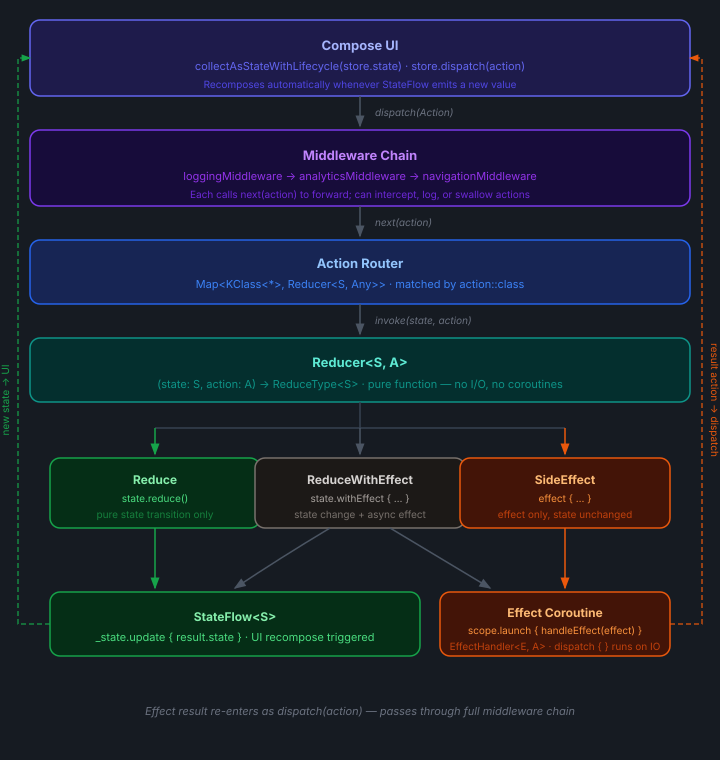
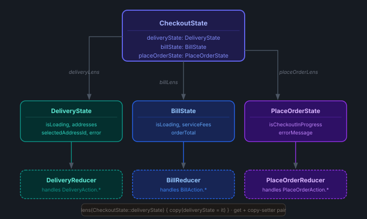
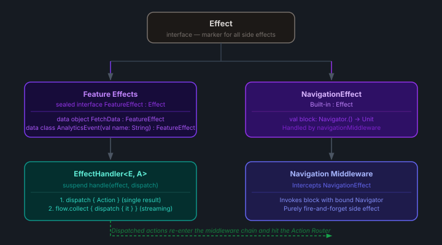
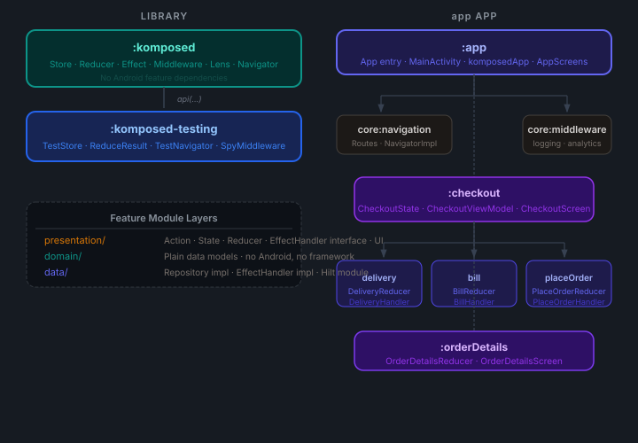
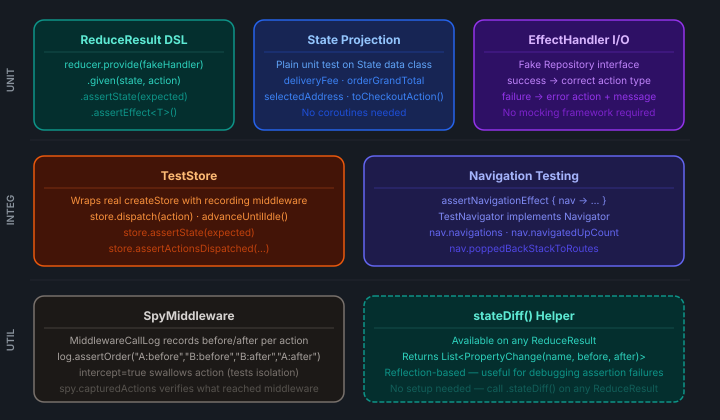

# Komposed

> Unidirectional state management for Android, built in Kotlin

[](https://central.sonatype.com/artifact/io.github.atwa/komposed)
[](https://github.com/atwa/komposed/actions/workflows/publish.yml)
[](https://opensource.org/licenses/MIT)
[](https://developer.android.com/studio/releases/platforms)
[](https://kotlinlang.org)

Komposed is a lightweight Kotlin library for predictable, testable state management on Android. State transitions are pure functions. Side effects are typed values routed to registered handlers. Everything composes — features, reducers, and tests alike.

Inspired by the core ideas of [The Composable Architecture (TCA)](https://github.com/pointfreeco/swift-composable-architecture) by Point-Free, Komposed adapts its fundamental building blocks — reducers, effects, lenses, and middleware — to idiomatic Kotlin and Jetpack Compose, without requiring any prior TCA knowledge.

---

## Architecture Diagrams

### 1 — Unidirectional Data Flow
Every state change follows a single predictable path. Actions flow down through middleware into reducers; new state and effects flow back up to the UI.



### 2 — State Composition via Lenses
A single global state is sliced into feature sub-states using `Lens<GLOBAL, LOCAL>`. Each reducer operates only on its own slice — completely unaware of siblings.



### 3 — Effect Routing
Effects are typed sealed values produced by reducers. The store routes each effect to the registered `EffectHandler` by type, which dispatches zero, one, or many actions back into the store.



### 4 — Module Structure
Core library modules have zero Android feature dependencies; each sample feature is its own Gradle module following the same internal layering.



### 5 — Testing Architecture
Each layer of the architecture has a dedicated testing tool. Pure reducers need no coroutines; integration tests use `TestScope` for deterministic async.



---

## Why Komposed?

| What you get | Why it matters |
|---|---|
| Pure reducers | No I/O, no handler injection — trivially unit-testable with plain assertions |
| Typed sealed effects | Effects are inspectable values, not opaque lambdas — fully assertable in tests |
| Compile-time action type safety | Dispatched actions from handlers are constrained to the feature's own action type |
| Lens-based composition | Multiple feature reducers share one global store with zero boilerplate |
| Extensible middleware | Logging, analytics, A/B flags — none of it touches a reducer |
| Navigation as an effect | `NavController` never leaks into a ViewModel or reducer |
| Fluent test DSL | `reducer.given(state, action).assertState(…).assertEffect<MyEffect>()` |

---

## Installation

Add the dependencies to your module's `build.gradle.kts`:

```kotlin
implementation("io.github.atwa:komposed:1.0.1")

// Testing utilities — add to the test source set only
testImplementation("io.github.atwa:komposed-testing:1.0.1")
```

Or with a version catalog (`gradle/libs.versions.toml`):

```toml
[versions]
komposed = "1.0.1"

[libraries]
komposed         = { group = "io.github.atwa", name = "komposed",         version.ref = "komposed" }
komposed-testing = { group = "io.github.atwa", name = "komposed-testing", version.ref = "komposed" }
```

```kotlin
implementation(libs.komposed)
testImplementation(libs.komposed.testing)
```

**Requirements:** minSdk 24 · Kotlin 2.0 · Java 11 · `kotlinx-coroutines-core` (transitive)

---

## Package Structure

```
io.github.atwa.komposed            → Store, Lens (main entry points)
io.github.atwa.komposed.reducer    → ReduceType, PureReducer, ReducerRegistry, DSLs
io.github.atwa.komposed.effect     → Effect, EffectHandler
io.github.atwa.komposed.middleware → Middleware, navigationMiddleware
io.github.atwa.komposed.navigation → Navigator, NavOptions, PopUpTo
```

---

## Quick Start

The five-minute path from zero to a working store:

```kotlin
// 1. State
data class CounterState(val count: Int = 0)

// 2. Actions
sealed interface CounterAction {
    data object Increment : CounterAction
    data object Decrement : CounterAction
}

// 3. Reducer (pure — no I/O, no injected handlers)
import io.github.atwa.komposed.reducer.ReduceType.Companion.reduce
import io.github.atwa.komposed.reducer.pureReducer

val counterReducer = pureReducer<CounterState, CounterAction> { state, action ->
    when (action) {
        CounterAction.Increment -> state.copy(count = state.count + 1).reduce()
        CounterAction.Decrement -> state.copy(count = state.count - 1).reduce()
    }
}

// 4. Store (inside ViewModel)
import io.github.atwa.komposed.createStore
import io.github.atwa.komposed.reducer.reducers

val store = createStore(
    initialValue = CounterState(),
    scope        = viewModelScope,
    reducers     = reducers { counterReducer.register() },
)

// 5. UI
val state by store.state.collectAsStateWithLifecycle()
Text("Count: ${state.count}")
Button(onClick = { store.dispatch(CounterAction.Increment) }) { Text("+") }
```

---

## Core Concepts

### State

State is an **immutable `data class`**. Every change produces a new instance via `copy()`. The store exposes it as `StateFlow<S>`, so Compose collects it automatically.

```kotlin
data class CartState(
    val items: List<CartItem> = emptyList(),
    val isLoading: Boolean    = false,
    val error: String?        = null,
)
```

For multi-feature screens, compose sub-states and declare **Lenses** as companions:

```kotlin
data class CheckoutState(
    val cart:       CartState       = CartState(),
    val delivery:   DeliveryState   = DeliveryState(),
    val placeOrder: PlaceOrderState = PlaceOrderState(),
) {
    companion object {
        val cartLens       = lens(CheckoutState::cart)       { copy(cart = it) }
        val deliveryLens   = lens(CheckoutState::delivery)   { copy(delivery = it) }
        val placeOrderLens = lens(CheckoutState::placeOrder) { copy(placeOrder = it) }
    }
}
```

---

### Actions

Actions are **`sealed interface`** hierarchies. They carry all data a reducer needs to compute the next state and are the _only_ way to trigger a change.

```kotlin
sealed interface CartAction {
    data object LoadCart : CartAction
    data class  CartLoaded(val items: List<CartItem>) : CartAction
    data class  CartFailed(val message: String)       : CartAction
    data class  RemoveItem(val itemId: String)        : CartAction
}
```

---

### ReduceType

Every reducer returns a `ReduceType<STATE>` — a sealed type with three variants, each constructed via a companion DSL:

```kotlin
import io.github.atwa.komposed.reducer.ReduceType.Companion.reduce
import io.github.atwa.komposed.reducer.ReduceType.Companion.withEffect
import io.github.atwa.komposed.reducer.ReduceType.Companion.effect
```

| Variant | DSL | When to use |
|---|---|---|
| `Reduce` | `state.reduce()` | Pure state transition, no side effects |
| `ReduceWithEffect` | `state.withEffect { MyEffect(…) }` | State change + async work |
| `SideEffect` | `effect { MyEffect(…) }` | Async work with no state change |

---

### Reducers

Reducers are always pure — they receive state and action, return a `ReduceType`, and have zero external dependencies. Side effects are expressed as typed sealed values, never as lambdas or injected handler calls.

```kotlin
import io.github.atwa.komposed.reducer.pureReducer

val cartReducer = pureReducer<CartState, CartAction> { state, action ->
    when (action) {
        CartAction.LoadCart ->
            state.copy(isLoading = true).withEffect { CartEffect.Load }

        is CartAction.CartLoaded ->
            state.copy(items = action.items, isLoading = false).reduce()

        is CartAction.CartFailed ->
            state.copy(isLoading = false, error = action.message).reduce()

        is CartAction.RemoveItem ->
            state.copy(items = state.items.filterNot { it.id == action.itemId }).reduce()
    }
}
```

---

### Effects

Effects are **typed sealed values** that describe intent — not lambdas that execute it. Declare one per feature:

```kotlin
import io.github.atwa.komposed.effect.Effect

sealed interface CartEffect : Effect {
    data object Load : CartEffect
    data class  Remove(val itemId: String) : CartEffect
}
```

The store routes each effect to the registered handler by its runtime type. The only built-in effect type is `NavigationEffect` — all others are feature-defined.

---

### EffectHandler

`EffectHandler<E, A>` is the single interface for all async work. Implement it directly — no intermediate feature interface is needed:

```kotlin
import io.github.atwa.komposed.effect.EffectHandler

class CartEffectHandlerImpl @Inject constructor(
    private val repository: CartRepository,
) : EffectHandler<CartEffect, CartAction> {

    override suspend fun handle(effect: CartEffect, dispatch: suspend (suspend () -> CartAction) -> Unit) {
        when (effect) {
            CartEffect.Load ->                          // single action result
                dispatch {
                    repository.getItems().fold(
                        onSuccess = { CartAction.CartLoaded(it) },
                        onFailure = { CartAction.CartFailed(it.message ?: "Unknown error") },
                    )
                }

            is CartEffect.Remove ->                    // fire-and-forget
                repository.removeItem(effect.itemId)  // no dispatch needed

            CartEffect.ObserveStock ->                 // flow of actions
                repository.stockStream().collect { item -> dispatch { CartAction.StockUpdated(item) } }
        }
    }
}
```

All three async patterns are handled by the same interface:
- **Single action** — call `dispatch { }` with a lambda returning the action
- **Fire-and-forget** — omit `dispatch` entirely
- **Multiple actions / streaming** — call `dispatch { }` inside a loop or `Flow.collect`

The `dispatch` lambda runs on `Dispatchers.IO` (where `handle` executes) and the resulting action is automatically posted back to the main thread by the store. The action type `A` is enforced at compile time — a `CartEffectHandler` can never accidentally dispatch a `DeliveryAction`.

---

### Middleware

Middleware intercepts every dispatched action **before** it reaches a reducer. Call `next(action)` to forward downstream. Omit it to swallow the action.

```kotlin
import io.github.atwa.komposed.middleware.createMiddleware

// Logging
fun <S> loggingMiddleware() = createMiddleware<S> { _, action, next ->
    Log.d("Komposed", "→ ${action::class.simpleName}")
    next(action)
}

// Analytics
fun <S> analyticsMiddleware() = createMiddleware<S> { _, action, next ->
    analytics.track(action::class.simpleName)
    next(action)
}

// Feature flag — swallows action when flag is off
fun <S> featureFlagMiddleware(flag: Boolean) = createMiddleware<S> { _, action, next ->
    if (action is BetaFeatureAction && !flag) return@createMiddleware
    next(action)
}
```

Middleware executes in declaration order. The built-in `navigationMiddleware(navigator)` intercepts any `NavigationEffect` before reducers see it.

---

### Lens

A `Lens<GLOBAL, LOCAL>` is an optics pair — a getter and a copy-setter — used to lift a local-state reducer into a global-state reducer:

```kotlin
import io.github.atwa.komposed.lens

val cartLens = lens(CheckoutState::cart) { copy(cart = it) }

// Pull a local reducer up to global state
val globalCartReducer: PureReducer<CheckoutState, CartAction> =
    cartReducer.pullback(cartLens)
```

The `reducers { }` DSL calls `pullback` automatically via `.scoped(lens)`.

---

### Store

`Store<S>` is the runtime container. It exposes:

- `state: StateFlow<S>` — the current state, observable by the UI
- `dispatch(action: Any)` — the single entry point for all state changes

```kotlin
import io.github.atwa.komposed.createStore
import io.github.atwa.komposed.reducer.reducers
import io.github.atwa.komposed.reducer.effectHandlers
import io.github.atwa.komposed.middleware.navigationMiddleware

val store = createStore(
    initialValue = CheckoutState(),
    scope        = viewModelScope,
    middlewares  = listOf(
        loggingMiddleware(),
        analyticsMiddleware(),
        navigationMiddleware(navigator),
    ),
    reducers = reducers {
        cartReducer.scoped(CheckoutState.cartLens)
        deliveryReducer.scoped(CheckoutState.deliveryLens)
        placeOrderReducer.scoped(CheckoutState.placeOrderLens)
    },
    effectHandlers = effectHandlers {
        cartEffectHandler.register()
        deliveryEffectHandler.register()
        placeOrderEffectHandler.register()
    },
)
```

**`reducers { }` registration methods:**

| Method | Use when |
|---|---|
| `PureReducer.scoped(lens)` | Reducer operates on a local state slice |
| `PureReducer.register()` | Reducer already operates on the full global state |

**`effectHandlers { }` registration:**

```kotlin
effectHandlers {
    cartEffectHandler.register()        // E inferred from receiver type
    deliveryEffectHandler.register()
}
```

The effect type `E` is inferred automatically — no explicit type argument needed.

After a reducer returns:

- `Reduce` → state updated on main thread
- `ReduceWithEffect` → state updated on main thread, then effect launched on `Dispatchers.IO`
- `SideEffect` → effect launched on `Dispatchers.IO`, no state change
- `NavigationEffect` — re-dispatched through the full middleware chain on the main thread; `navigationMiddleware` intercepts and executes it; reducers never see it

---

## Threading

Threading is **enforced by the store internally**. Client code passes a plain `CoroutineScope` (e.g. `viewModelScope`) with no dispatcher override.

| What | Dispatcher |
|---|---|
| Action routing through middleware | `Dispatchers.Main.immediate` |
| Reducer invocation and state updates | `Dispatchers.Main.immediate` |
| `EffectHandler.handle` body | `Dispatchers.IO` |
| Actions dispatched back from handlers | `Dispatchers.Main.immediate` |
| `NavigationEffect` re-dispatch | `Dispatchers.Main.immediate` |

```kotlin
// ViewModel — no dispatcher override needed
val store = createStore(
    initialValue = CheckoutState(),
    scope        = viewModelScope,   // plain scope, no + Dispatchers.Main.immediate
    reducers     = reducers { ... },
    effectHandlers = effectHandlers { ... },
)
```

Because `Dispatchers.Main.immediate` executes synchronously when the caller is already on the main thread, `dispatch()` feels like a regular function call from the UI — no observable async delay.

### Testing

`TestStore` replaces both dispatchers with `UnconfinedTestDispatcher` so coroutines execute eagerly in tests. Synchronous state transitions (pure reducer actions) are visible immediately after `dispatch()`. Call `advanceUntilIdle()` only when asserting the outcome of an async effect round-trip.

```kotlin
@Test
fun `SelectAddress routes to delivery reducer`() = runTest {
    val store = buildStore(this)
    store.dispatch(DeliveryAction.OnDeliveryAddressSelected(1L))
    // No advanceUntilIdle() needed — UnconfinedTestDispatcher runs eagerly
    store.assertState(CheckoutState(deliveryState = DeliveryState(selectedAddressId = 1L)))
}

@Test
fun `FetchAddresses effect loads addresses into state`() = runTest {
    val store = buildStore(this)
    store.dispatch(DeliveryAction.FetchDeliveryAddresses)
    advanceUntilIdle()  // wait for the effect handler coroutine to complete
    assert(store.state.value.deliveryState.addresses.isNotEmpty())
}
```

---

## Navigation

Navigation is treated as just another dispatched effect. `NavController` never appears in a ViewModel or reducer.

### 1. Implement `Navigator`

```kotlin
import io.github.atwa.komposed.navigation.Navigator
import io.github.atwa.komposed.navigation.NavOptions

@Singleton
class NavigatorImpl @Inject constructor() : Navigator {
    private var navController: NavController? = null

    fun bind(controller: NavController) { navController = controller }

    override fun <T : Any> navigate(route: T) {
        navController?.navigate(route)
    }

    override fun <T : Any> navigate(route: T, navOptions: NavOptions) {
        val androidOptions = navOptions {
            launchSingleTop = navOptions.launchSingleTop
            restoreState    = navOptions.restoreState
            navOptions.popUpTo?.let { popUpTo(it.route) { inclusive = it.inclusive; saveState = it.saveState } }
        }
        navController?.navigate(route, androidOptions)
    }

    override fun navigateUp()  { navController?.navigateUp() }
    override fun popBackStack() { navController?.popBackStack() }
    override fun <T : Any> popBackStackTo(route: T, inclusive: Boolean, saveState: Boolean) {
        navController?.popBackStack(route, inclusive, saveState)
    }
}
```

### 2. Bind in your NavHost

```kotlin
@Composable
fun AppNavHost(navigator: NavigatorImpl = hiltViewModel()) {
    val navController = rememberNavController()
    LaunchedEffect(navController) { navigator.bind(navController) }

    NavHost(navController, startDestination = CartRoute) {
        composable<CartRoute>         { CheckoutScreen() }
        composable<OrderDetailsRoute> { OrderDetailsScreen() }
    }
}
```

### 3. Navigate from a Reducer

```kotlin
// Simple navigation
is CartAction.GoBack ->
    effect { NavigationEffect { navigateUp() } }

// Navigate to a route
is PlaceOrderAction.OrderPlaced ->
    state.copy(isCheckoutInProgress = false).withEffect {
        NavigationEffect { navigate(OrderDetailsRoute(orderId = action.orderId)) }
    }

// Navigate with options — single top, pop up to login
is AuthAction.LoginSuccess ->
    effect {
        NavigationEffect {
            navigate(
                HomeRoute,
                NavOptions(
                    launchSingleTop = true,
                    popUpTo = PopUpTo(LoginRoute, inclusive = true),
                )
            )
        }
    }
```

### 4. Cross-domain state projection

When an action needs data from multiple sub-states, map the parent state to a domain model and let the composable or ViewModel construct the action. Each sub-reducer stays pure and unaware of its siblings:

```kotlin
// CheckoutState.kt — returns a domain model, not an action
fun toCheckoutParams() = CheckoutParams(
    addressId    = deliveryState.selectedAddressId,  // null = no address selected
    deliveryNote = deliveryState.deliveryNote,
    addressLine  = deliveryState.selectedAddress?.addressLine ?: "",
    city         = deliveryState.selectedAddress?.city ?: "",
    deliveryFees = deliveryFee,
    serviceFees  = billState.serviceFees,
    orderTotal   = billState.orderTotal,
)

// Composable — constructs the action with the params
onCheckout = { dispatch(PlaceOrderAction.Checkout(state.toCheckoutParams())) }

// PlaceOrderReducer — owns the validation logic
is PlaceOrderAction.Checkout -> action.params.addressId?.let {
    state.copy(isCheckoutInProgress = true).withEffect {
        PlaceOrderEffect.PlaceOrder(action.params)
    }
} ?: state.copy(errorMessage = "Please select a delivery address").reduce()
```

---

## ViewModel Integration

The ViewModel creates the store lazily and owns the coroutine scope. It injects typed `EffectHandler` instances directly — no intermediate feature interfaces:

```kotlin
import io.github.atwa.komposed.effect.EffectHandler

@HiltViewModel
class CheckoutViewModel @Inject constructor(
    private val cartEffectHandler:      EffectHandler<CartEffect,      CartAction>,
    private val deliveryEffectHandler:  EffectHandler<DeliveryEffect,  DeliveryAction>,
    private val placeOrderEffectHandler: EffectHandler<PlaceOrderEffect, PlaceOrderAction>,
    private val navigator: Navigator,
) : ViewModel() {

    val store by lazy {
        createStore(
            initialValue = CheckoutState(),
            scope        = viewModelScope,
            middlewares  = listOf(
                loggingMiddleware(),
                analyticsMiddleware(),
                navigationMiddleware(navigator),
            ),
            reducers = reducers {
                cartReducer.scoped(CheckoutState.cartLens)
                deliveryReducer.scoped(CheckoutState.deliveryLens)
                placeOrderReducer.scoped(CheckoutState.placeOrderLens)
            },
            effectHandlers = effectHandlers {
                cartEffectHandler.register()
                deliveryEffectHandler.register()
                placeOrderEffectHandler.register()
            },
        )
    }

    init {
        store.dispatch(CartAction.LoadCart)
        store.dispatch(DeliveryAction.FetchAddresses)
    }

    fun onCheckout() = store.dispatch(
        PlaceOrderAction.Checkout(store.state.value.toCheckoutParams())
    )
}
```

### Hilt binding

Bind each handler to the fully-parameterized library interface — Dagger resolves by full parameterized type at compile time:

```kotlin
@Module
@InstallIn(SingletonComponent::class)
abstract class CartModule {
    @Binds
    abstract fun bindCartEffectHandler(
        impl: CartEffectHandlerImpl,
    ): EffectHandler<CartEffect, CartAction>
}
```

---

## Compose UI

Collect the store's `StateFlow` with `collectAsStateWithLifecycle` and forward user events as dispatched actions:

```kotlin
@Composable
fun CheckoutScreen(viewModel: CheckoutViewModel = hiltViewModel()) {
    val state by viewModel.store.state.collectAsStateWithLifecycle()

    CartSection(
        items     = state.cart.items,
        isLoading = state.cart.isLoading,
        onRemove  = { viewModel.store.dispatch(CartAction.RemoveItem(it)) },
    )

    DeliverySection(
        addresses         = state.delivery.addresses,
        selectedAddressId = state.delivery.selectedAddressId,
        onSelect          = { viewModel.store.dispatch(DeliveryAction.SelectAddress(it)) },
    )

    CheckoutButton(
        isLoading = state.placeOrder.isCheckoutInProgress,
        onClick   = { viewModel.store.dispatch(
            PlaceOrderAction.Checkout(state.toCheckoutParams())
        )},
    )
}
```

---

## Testing

### Unit Testing Reducers

`reducer.given(state, action)` invokes the reducer and returns a chainable `ReduceResult`. No fake handlers or `provide()` calls needed — reducers are pure:

```kotlin
import io.github.atwa.komposed.testing.given
import io.github.atwa.komposed.testing.assertState
import io.github.atwa.komposed.testing.assertEffect
import io.github.atwa.komposed.testing.assertNoEffect

class CartReducerTest {

    @Test
    fun `LoadCart sets isLoading and emits Load effect`() {
        cartReducer.given(CartState(), CartAction.LoadCart)
            .assertState(CartState(isLoading = true))
            .assertEffect<CartEffect.Load>()
    }

    @Test
    fun `CartLoaded populates items and clears isLoading`() {
        val items = listOf(CartItem("1", "Widget", 9.99))
        cartReducer.given(CartState(isLoading = true), CartAction.CartLoaded(items))
            .assertState(CartState(items = items, isLoading = false))
            .assertNoEffect()
    }

    @Test
    fun `CartFailed stores error message`() {
        cartReducer.given(CartState(isLoading = true), CartAction.CartFailed("Timeout"))
            .assertState(CartState(isLoading = false, error = "Timeout"))
            .assertNoEffect()
    }

    @Test
    fun `OrderPlaced emits NavigationEffect to OrderDetails`() {
        cartReducer.given(CartState(), CartAction.OrderPlaced(orderId = "42"))
            .assertNavigationEffect { nav ->
                assert(nav.navigations.last() == OrderDetailsRoute("42"))
            }
    }
}
```

**Available assertions:**

| Method | What it checks |
|---|---|
| `assertState(expected)` | `nextState == expected` |
| `assertNoStateChange()` | `nextState == previousState` |
| `assertEffect<E>(verify)` | Effect is of type `E`; optional lambda to inspect its fields |
| `assertNoEffect()` | No effect was emitted |
| `assertNavigationEffect { nav -> }` | Effect is `NavigationEffect`; executes it on a `TestNavigator` spy |
| `stateDiff()` | Returns `List<PropertyChange(name, before, after)>` for debugging |

---

### Unit Testing Effect Handlers

The `komposed-testing` module provides a `handle(effect)` extension that collects every dispatched action and returns them as a `List<A>` — no capture variable or lambda needed:

```kotlin
import io.github.atwa.komposed.testing.handle

class CartEffectHandlerImplTest {

    private fun handlerWith(repository: CartRepository) = CartEffectHandlerImpl(repository)

    @Test
    fun `Load dispatches CartLoaded on success`() = runTest {
        val items = listOf(CartItem("1", "Widget", 9.99))
        val repo = object : CartRepository {
            override suspend fun getItems() = Result.success(items)
        }
        val result = handlerWith(repo).handle(CartEffect.Load)
        assert(result.single() == CartAction.CartLoaded(items))
    }

    @Test
    fun `Load dispatches CartFailed with message on failure`() = runTest {
        val repo = object : CartRepository {
            override suspend fun getItems() = Result.failure<List<CartItem>>(RuntimeException("Network error"))
        }
        val result = handlerWith(repo).handle(CartEffect.Load)
        assert(result.single() == CartAction.CartFailed("Network error"))
    }
}
```

Use `result.single()` when exactly one action is expected, `result.isEmpty()` for fire-and-forget effects, or iterate for streaming handlers.

---

### Integration Testing with TestStore

`TestStore` wraps a real store and injects a recording middleware that captures every action, including secondary ones produced by effects. Pass fake `EffectHandler` implementations directly:

```kotlin
import io.github.atwa.komposed.testing.TestStore

class CheckoutStoreTest {

    private val fakeCartHandler = object : EffectHandler<CartEffect, CartAction> {
        override suspend fun handle(effect: CartEffect, dispatch: suspend (suspend () -> CartAction) -> Unit) {
            when (effect) {
                CartEffect.Load -> dispatch { CartAction.CartLoaded(listOf(testItem)) }
            }
        }
    }

    private val fakeDeliveryHandler = object : EffectHandler<DeliveryEffect, DeliveryAction> {
        override suspend fun handle(effect: DeliveryEffect, dispatch: suspend (suspend () -> DeliveryAction) -> Unit) {
            when (effect) {
                DeliveryEffect.FetchAddresses ->
                    dispatch { DeliveryAction.AddressesLoaded(listOf(testAddress)) }
            }
        }
    }

    private fun buildStore(scope: TestScope) = TestStore(
        initialState = CheckoutState(),
        scope        = scope,
        reducers = reducers {
            cartReducer.scoped(CheckoutState.cartLens)
            deliveryReducer.scoped(CheckoutState.deliveryLens)
        },
        effectHandlers = effectHandlers {
            fakeCartHandler.register()
            fakeDeliveryHandler.register()
        },
    )

    @Test
    fun `LoadCart effect round-trip updates state`() = runTest {
        val store = buildStore(this)
        store.dispatch(CartAction.LoadCart)
        advanceUntilIdle()
        store.assertState(CheckoutState(cart = CartState(items = listOf(testItem))))
    }

    @Test
    fun `SelectAddress routes to delivery reducer`() = runTest {
        val store = buildStore(this)
        store.dispatch(DeliveryAction.SelectAddress(1L))
        store.assertState(CheckoutState(delivery = DeliveryState(selectedAddressId = 1L)))
    }
}
```

**`TestStore` members:**

| Member | Description |
|---|---|
| `state: StateFlow<S>` | Live state — same as the real store |
| `dispatchedActions: List<Any>` | Every action seen in order, including effect results |
| `assertState(expected)` | Throws with a before/after message on mismatch |
| `assertActionsDispatched(vararg expected)` | Full equality check on the complete action sequence |

Call `advanceUntilIdle()` after dispatching an action that triggers an effect.

---

### Testing Navigation

```kotlin
@Test
fun `OrderPlaced emits NavigationEffect to OrderDetails`() {
    placeOrderReducer.given(PlaceOrderState(), PlaceOrderAction.OrderPlaced(orderId = "order-99"))
        .assertNavigationEffect { nav ->
            assert(nav.navigations.last() == OrderDetailsRoute(orderId = "order-99"))
        }
}

@Test
fun `LoginSuccess navigates to Home with single-top and popUpTo`() {
    authReducer.given(AuthState(), AuthAction.LoginSuccess)
        .assertNavigationEffect { nav ->
            val (route, options) = nav.navigationsWithOptions.last()
            assert(route == HomeRoute)
            assert(options.launchSingleTop)
            assert(options.popUpTo?.route == LoginRoute)
            assert(options.popUpTo?.inclusive == true)
        }
}

@Test
fun `GoBack calls navigateUp once`() {
    cartReducer.given(CartState(), CartAction.GoBack)
        .assertNavigationEffect { nav ->
            assert(nav.navigatedUpCount == 1)
        }
}
```

**`TestNavigator` properties:**

| Property | Type | Description |
|---|---|---|
| `navigations` | `List<Any>` | Every route passed to `navigate()`, in call order |
| `navigationsWithOptions` | `List<Pair<Any, NavOptions>>` | Routes paired with their `NavOptions`, for options assertions |
| `navigatedUpCount` | `Int` | Number of `navigateUp()` calls |
| `poppedBackStackCount` | `Int` | Number of `popBackStack()` calls |
| `poppedBackStackToRoutes` | `List<Triple<Any, Boolean, Boolean>>` | Arguments of each `popBackStackTo()` call |

---

## Module Structure

```
komposed/               Core library — Store, Reducer, Effect, EffectHandler, Middleware, Lens, Navigator
komposed-testing/       Test helpers — depends only on :komposed

sample/
├── (app)               Entry point · AppNavHost · Hilt setup
├── checkout/           Composed checkout screen · CheckoutState · CheckoutViewModel
│   ├── delivery/       DeliveryReducer · DeliveryEffect · DeliveryEffectHandlerImpl
│   ├── bill/           BillReducer · BillEffect · BillEffectHandlerImpl
│   └── placeOrder/     PlaceOrderReducer · PlaceOrderEffect · PlaceOrderEffectHandlerImpl · CheckoutParams
├── orderDetails/       Order confirmation screen
└── core/
    ├── navigation/     Route definitions · NavigatorImpl · Hilt binding
    └── middleware/     loggingMiddleware · analyticsMiddleware
```

Each feature sub-module follows the same internal layering:

```
presentation/   Action sealed interface · State data class · Effect sealed interface · Reducer · Composable
domain/         Plain data models (no Android, no framework)
data/           Repository interface + impl · EffectHandlerImpl · Hilt @Binds module
```

---

## License

```
MIT License

Copyright (c) 2024 Ahmed Atwa

Permission is hereby granted, free of charge, to any person obtaining a copy
of this software and associated documentation files (the "Software"), to deal
in the Software without restriction, including without limitation the rights
to use, copy, modify, merge, publish, distribute, sublicense, and/or sell
copies of the Software, and to permit persons to whom the Software is
furnished to do so, subject to the following conditions:

The above copyright notice and this permission notice shall be included in all
copies or substantial portions of the Software.

THE SOFTWARE IS PROVIDED "AS IS", WITHOUT WARRANTY OF ANY KIND, EXPRESS OR
IMPLIED, INCLUDING BUT NOT LIMITED TO THE WARRANTIES OF MERCHANTABILITY,
FITNESS FOR A PARTICULAR PURPOSE AND NONINFRINGEMENT. IN NO EVENT SHALL THE
AUTHORS OR COPYRIGHT HOLDERS BE LIABLE FOR ANY CLAIM, DAMAGES OR OTHER
LIABILITY, WHETHER IN AN ACTION OF CONTRACT, TORT OR OTHERWISE, ARISING FROM,
OUT OF OR IN CONNECTION WITH THE SOFTWARE OR THE USE OR OTHER DEALINGS IN
THE SOFTWARE.
```
